# MaPaPis — Casuística completa de la app

> Documento vivo. Refleja el **estado real de la app a 2026-04-25** (post migración `016_pagos_externos.sql`). Incluye actores, modelo de datos, estados, flujos en Mermaid y casos límite.
> Lo que no figura acá no existe todavía. Si algo se contradice con el código, gana el código.

---

## 1. Resumen ejecutivo

MaPaPis es un **marketplace PWA de compras grupales escolares** para Argentina. Tres audiencias:

- **Familias**: papás/mamás/tutores de un grupo (sala de jardín, aula, comisión). Publican necesidades, votan, pagan a la pyme adjudicada.
- **Pymes**: librerías, imprentas, catering, indumentaria, etc. Ofertan respondiendo a necesidades, cobran y entregan.

> **Modelo de cobro objetivo: escrow on-platform.** Las familias pagan dentro de la app, MaPaPis **retiene el dinero**, y se libera a la pyme una vez confirmada la entrega (`marcar_cumplida`). Esto requiere Mercado Pago Marketplace API + split de pagos (ver [spec-pagos-escrow.md](spec-pagos-escrow.md)). Hoy todavía no está implementado: el flujo vivo (Sprint 1) es **off-platform** — la pyme cobra por transferencia (CBU/alias) y las familias marcan el pago manualmente. Toda la sección de pagos en este doc describe el flujo interino; el módulo MP es el siguiente hito grande.
- **Instituciones / personal_institucion**: jardines/colegios. Pueden publicar necesidades transversales. Hoy es un rol con onboarding básico, sin diferenciación profunda de UX.

El flujo canónico (objetivo final):

```
familia crea grupo → invita papás → publica necesidad → pymes ofertan
→ familias votan → admin adjudica → familias pagan ON-PLATFORM (MP, escrow)
→ admin/pyme marca cumplida → MaPaPis libera el dinero a la pyme menos comisión
```

Hoy (Sprint 1) el cobro **todavía es off-platform** mientras no está integrado MP — ver §7.5 (interino) y §7.5b (modelo definitivo).

Stack: Supabase (Postgres + Auth + RLS + RPCs `security definer`) y un único `index.html` con React UMD + Tailwind CDN + Service Worker. **No hay backend propio**.

---

## 2. Stack y arquitectura

| Capa | Tecnología | Notas |
|------|-----------|-------|
| Auth | Supabase Auth (magic link / email+pass) | Trigger `handle_new_user` crea `profiles` con rol default `familia` |
| DB | Postgres (Supabase) | RLS habilitado, RPCs `security definer` para lógica con permisos cruzados |
| Storage | Supabase Storage | Bucket `necesidad-fotos` (público) |
| Frontend | `github-pages/mapapis/index.html` | React 18 UMD + Babel standalone + Tailwind CDN. Todo en un solo archivo |
| PWA | `sw.js` cache-first + `manifest.json` | Standalone, instalable |
| Hosting | GitHub Pages (push a `main`) | URL: https://tobcde.github.io/mapapis |

> Detalle de arquitectura Supabase: ver [spec-arquitectura-supabase.md](spec-arquitectura-supabase.md).

---

## 3. Actores y roles

### 3.1 Roles globales (`profiles.role`)

Definidos en `db/001_slice1_profiles.sql:11-12` (nullable desde `db/013_profiles_role_nullable.sql`).

| Rol | Quién es | Qué puede hacer |
|-----|----------|------------------|
| `familia` | Papá / mamá / tutor | Crear grupo, invitar, anotar alumnos, publicar necesidad, votar, pagar |
| `pyme` | Comerciante | Ver necesidades públicas, ofertar, marcar cumplida (si gana), recibir contacto del admin |
| `institucion` | Escuela/jardín | Publicar necesidades transversales (rol existente, UX limitada) |
| `personal_institucion` | Maestra/coordinador | Idem (rol existente, UX limitada) |
| `admin` | Operador MaPaPis (founders) | Reservado, sin pantalla dedicada todavía |

`profile.role = null` → la app fuerza pasar por `OnboardingRolScreen`. Existe "Cambiar de rol" en `PerfilScreen` que setea `role = null` y reinicia onboarding.

### 3.2 Roles dentro de un grupo (`grupo_miembros.rol_en_grupo`)

Independiente del rol global. Un mismo `profile` puede ser `creador` en un grupo y `miembro` en otro.

| Rol en grupo | Permisos |
|--------------|----------|
| `creador` | Todo lo de admin + promover/degradar admins, regenerar invite, no puede salir del grupo |
| `admin` | Cerrar inscripción, adjudicar oferta, marcar cumplida, revertir cumplida (24hs), kickear miembros |
| `miembro` | Anotar alumnos, votar, marcar pago propio, salir del grupo |

> Helper SQL: `public.es_admin_grupo(grupo, profile)` — true si `creador` o `admin` (`db/010_cierre_inscripcion.sql:18`).

---

## 4. Modelo de datos (esencial)

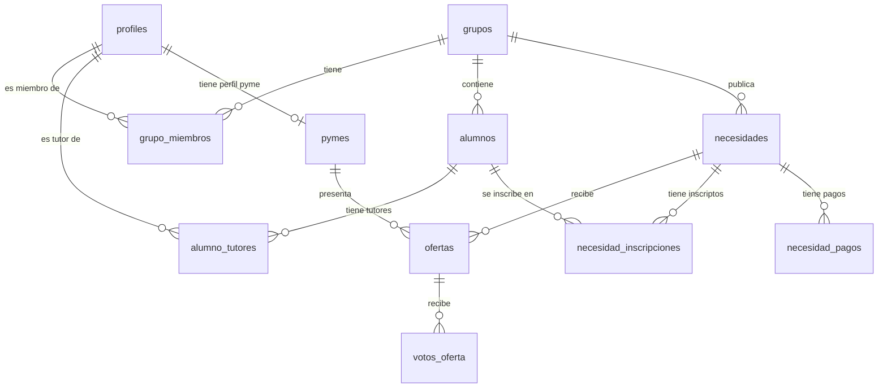

**Reglas distintivas:**

- `alumno_tutores` es N:M → un alumno puede tener **varios tutores** (padres separados, abuelos, padrinos). Hasta 4 tutores por alumno. Ver §6.
- `alumnos.dni` es la clave canónica de dedupe entre tutores que cargan al mismo chico desde cuentas distintas. **Nunca se muestra en la UI** (datos sensibles de menor). Ver §6.2.
- `necesidades.modalidad ∈ { 'grupal', 'individual' }`. En **grupal** todos los miembros del grupo están implícitamente incluidos. En **individual** los tutores deben anotar a cada alumno (`necesidad_inscripciones`).
- `necesidad_pagos` tiene **dos índices únicos parciales**:
  - Individual: `(necesidad_id, alumno_id) WHERE alumno_id IS NOT NULL`
  - Grupal: `(necesidad_id, profile_id) WHERE alumno_id IS NULL`

---

## 5. Estados de la necesidad

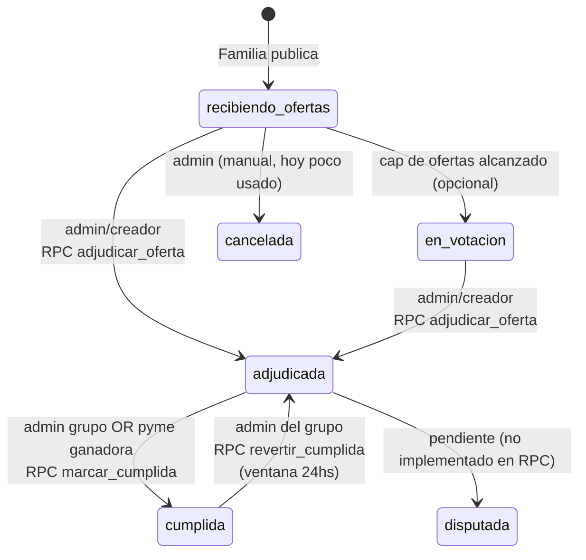

> `en_curso` está soportado en RPCs de pago (acepta como estado válido para registrar) pero **no hay transición** automática hoy. Queda como estado intermedio futuro entre `adjudicada` y `cumplida`.

---

## 6. Familias con múltiples tutores (padres separados, abuelos, etc.)

Caso central del producto: un alumno puede ser representado por más de un adulto.

### 6.1 Modelo

`alumno_tutores (alumno_id, profile_id)` permite hasta **4 tutores por alumno**. Ningún tutor es "principal" — son simétricos.

### 6.2 Cómo se vinculan — match por DNI (decisión de producto)

**Regla de producto:** al sumar un alumno al grupo, el tutor ingresa **nombre + DNI**. El DNI es el identificador canónico para detectar al mismo chico cuando otro tutor (papá separado, abuela, etc.) lo registra después. El **DNI nunca se muestra en la app** — es solo clave de match interna. El nombre se muestra como label, puede tener typos o variantes (Mateo / Mateo José / Mati) y eso es OK porque el match se resuelve por DNI.

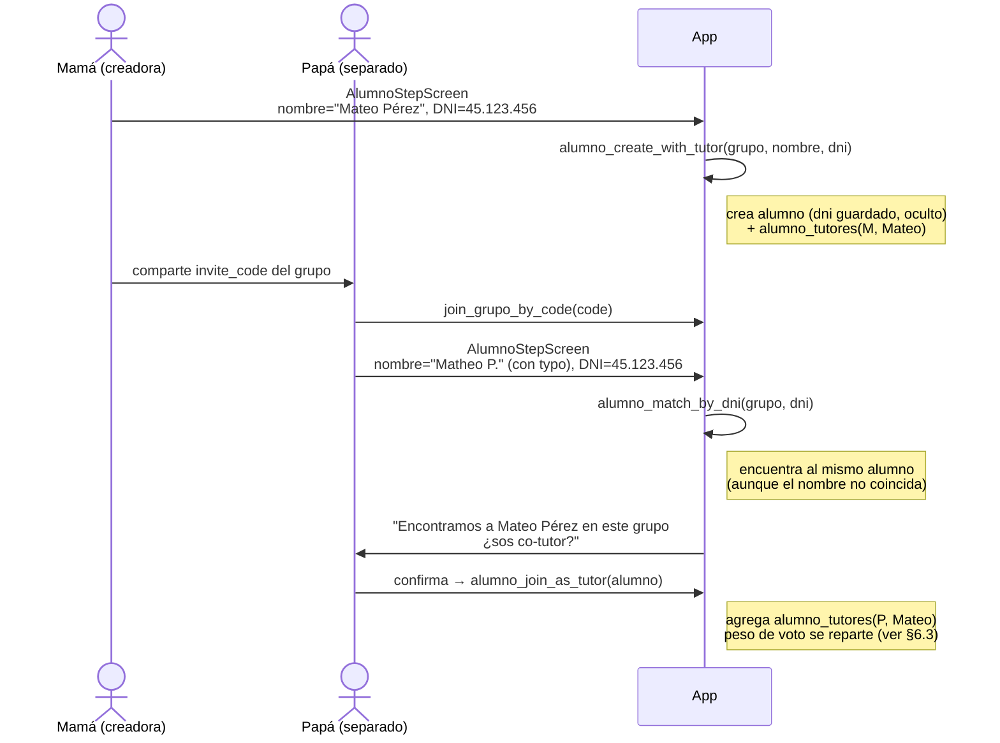

**Por qué DNI y no solo nombre:** padres separados muchas veces escriben el nombre distinto (con o sin segundo nombre, con o sin apellido materno, con typos). Hacer el dedupe por nombre lleva a duplicados que después hay que `alumnos_merge` a mano. DNI es único, irrefutable, y sin fricción real (todo padre lo sabe de memoria).

**Por qué oculto:** el DNI de un menor es dato sensible (Ley 25.326 datos personales). No agrega valor mostrarlo en ningún lado de la UI — solo necesitamos que el sistema lo use para matchear.

**RPCs (en `db/005_alumnos_tutores_institucion.sql` + migración futura para DNI):**

- `alumno_create_with_tutor(grupo, nombre, dni)` — crea alumno + agrega caller como tutor. **Pendiente**: agregar param `dni`.
- `alumno_match_by_dni(grupo, dni)` — **pendiente**, será el match primario al sumarse un nuevo tutor.
- `alumno_match_by_name(grupo, nombre)` — fallback case-insensitive, hoy es el único método. Queda como red secundaria si alguien no quiere ingresar DNI.
- `alumno_join_as_tutor(alumno)` — caller se vincula como co-tutor (sin cambios).
- `alumno_leave_as_tutor(alumno)` — desvincularse; **si queda sin tutores, el alumno se borra** (sin cambios).
- `alumnos_merge(keep, merge)` — admin/creador fusiona dos alumnos duplicados, consolida tutores (queda como salida de emergencia si dos tutores cargaron DNIs distintos por error).

**Estado de implementación (a 2026-04-25):**

- 🟡 Pendiente: columna `alumnos.dni text` (nullable durante migración suave, NOT NULL en altas nuevas a futuro), índice único parcial `(grupo_id, dni) WHERE dni IS NOT NULL`, validación de formato (7-8 dígitos), RPC `alumno_match_by_dni`, UI en `AlumnoStepScreen` con campo DNI + nota "no se muestra a nadie".
- 🟢 Hoy: match solo por nombre. Es frágil; planeamos que el DNI lo reemplace como primary match key en una próxima migración (`db/017_alumnos_dni.sql`).

### 6.3 Voto en modalidad individual

Cada alumno **vale 1 voto entero**, no 1 voto por tutor. Si dos tutores votan por la misma oferta para el mismo alumno, no se cuenta doble. Si votan distinto, gana el último voto registrado (la lógica actual sobreescribe; futuro: requerir consenso o mostrar empate).

> Comportamiento exacto: `peso` por tutor en `votos_oferta` (numeric 0.01-1.00). Hoy el FE registra peso 1.0 y sobreescribe en conflicto. Detalle de rebalanceo "automático" descrito en `db/005:6-9` está parcialmente implementado.

### 6.4 Pago en modalidad individual

Una sola fila por alumno (`alumno_id` único). **Cualquiera de los tutores** puede marcar el pago — el primero que lo haga "gana". El campo `marcado_por` registra quién fue. Si el otro tutor lo revoca, debe ser él mismo o un admin del grupo.

### 6.5 Pago en modalidad grupal

Una fila por `profile_id` (familia). Cuando hay padres separados:
- Si **ambos están en el grupo**: cada uno tiene su propia fila → la familia "paga doble" (caso raro pero posible).
- Si **solo uno está**: él/ella paga por la familia.

Hoy no hay un concepto de "unidad familiar" agrupando tutores. Es algo a evaluar post-PMF.

---

## 7. Flujos completos

### 7.1 Onboarding de un papá

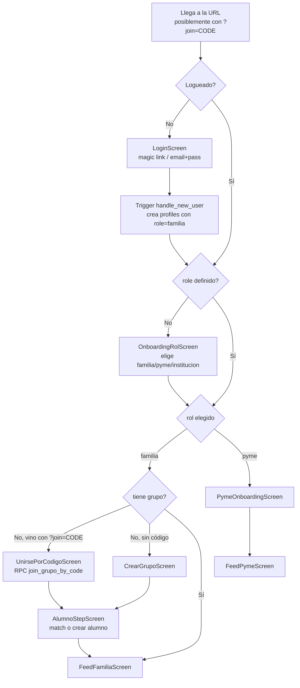

### 7.2 Crear grupo + invitar

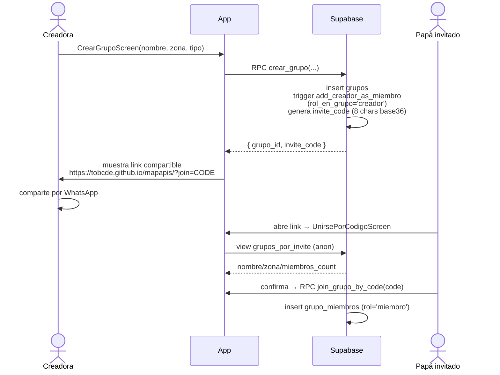

### 7.3 Publicar y resolver una necesidad (modalidad grupal)

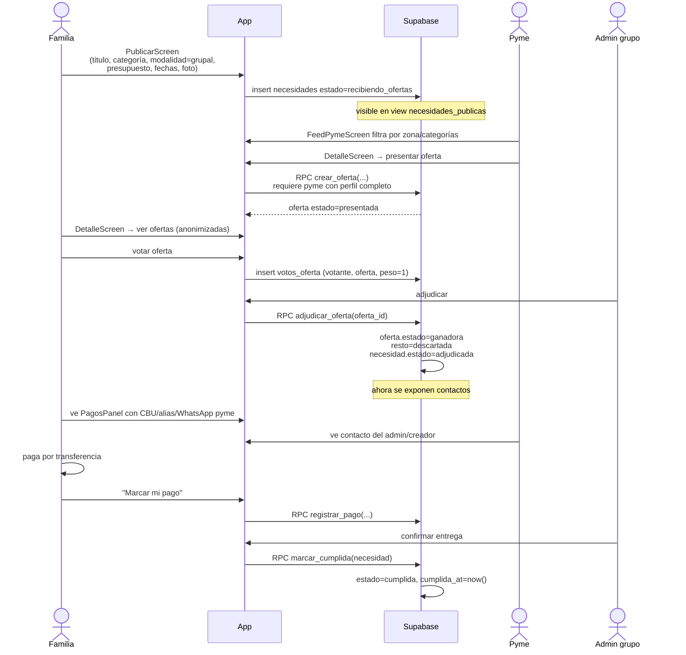

### 7.4 Modalidad individual + inscripción

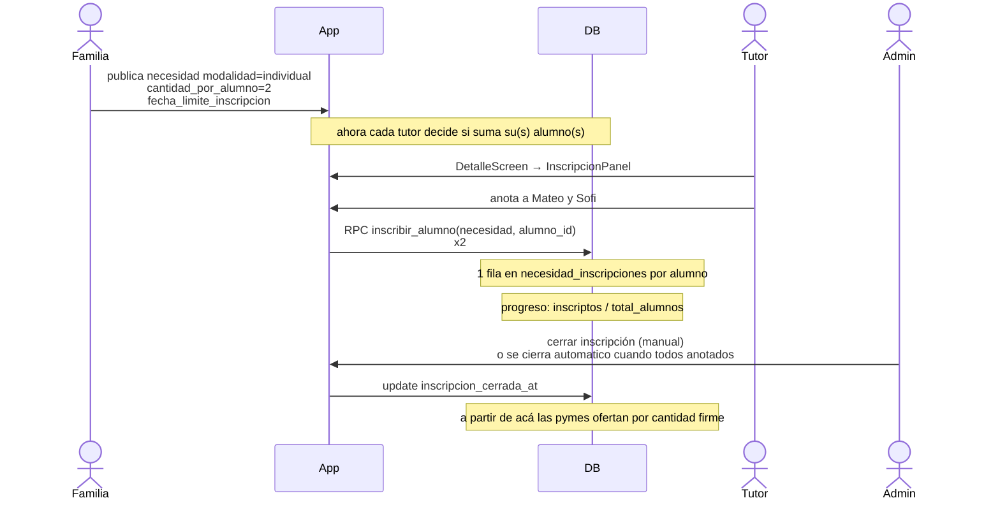

Diferencias clave individual vs grupal:

| Aspecto | Grupal | Individual |
|---------|--------|------------|
| Quién está incluido | Todos los miembros del grupo | Solo tutores que anotaron alumnos |
| Cantidad final | Implícita (n_familias) | inscriptos × cantidad_por_alumno |
| Voto | Por familia (peso 1) | Por alumno (peso compartido entre tutores) |
| Pago | 1 fila por familia | 1 fila por alumno |

### 7.5 Pago (post-adjudicación) — flujo interino off-platform

> **Atención**: ésta es la implementación **interina** mientras no esté Mercado Pago Marketplace API. El modelo definitivo es escrow on-platform — ver §7.5b y [spec-pagos-escrow.md](spec-pagos-escrow.md).


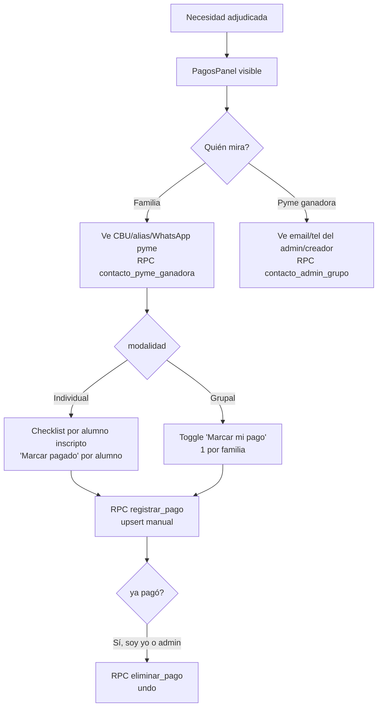

Reglas de quién puede registrar/eliminar (ver `db/016`):

- **Individual**: tutor del alumno, o admin del grupo. Si admin actúa, se asigna como pagante el primer tutor del alumno (orden por `created_at` en `alumno_tutores`).
- **Grupal**: cualquier miembro del grupo, o admin.
- **Eliminar**: solo `marcado_por` o admin.

### 7.5b Pago — modelo objetivo (escrow on-platform, NO implementado)

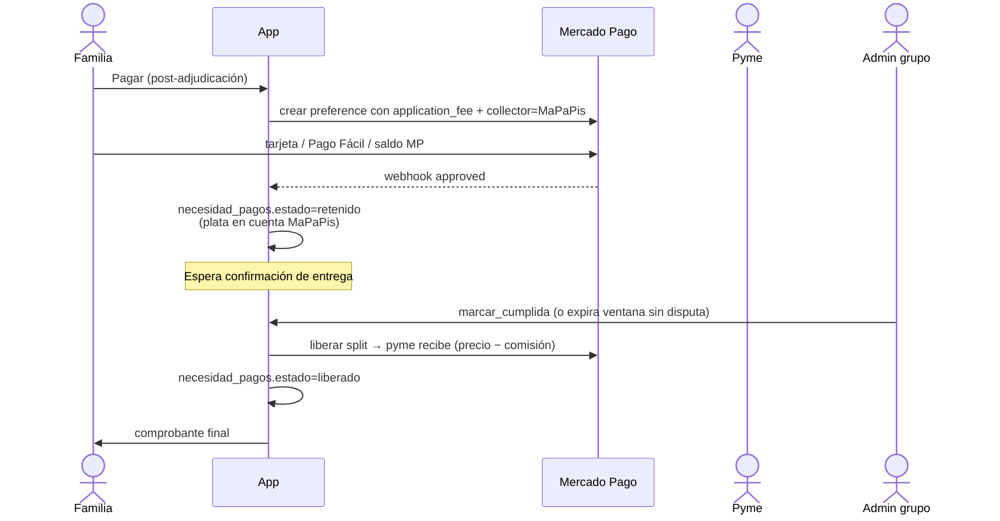

**Reglas que cambian respecto al flujo interino:**

- La familia paga dentro de la app; el dinero queda **retenido en la cuenta MaPaPis**, no llega a la pyme hasta confirmar entrega.
- Si se dispara `revertir_cumplida` dentro de las 24hs **el dinero todavía no se liberó** → puede volver al estado retenido sin movimientos bancarios reales.
- Si nadie marca cumplida en N días post-adjudicación → ventana de disputa abierta (TODO: definir N, hoy ~7 días candidato).
- Comisión MaPaPis: aplicada como `application_fee` en la preference; descuento automático al liberar el split.
- Casos a definir: refund parcial, contracargo, falla de webhook, entrega parcial en modo individual.

Estado: spec preliminar en [spec-pagos-escrow.md](spec-pagos-escrow.md). Implementación = Slice 4. Hasta entonces vale §7.5.

### 7.6 Cumplida y revertir

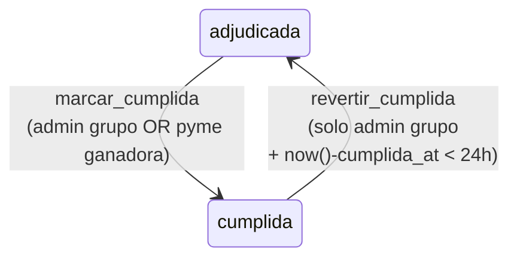

Validaciones:
- `marcar_cumplida` exige `estado='adjudicada'`. Si ya está cumplida o cancelada, falla.
- `revertir_cumplida` exige ventana < 24hs y rol admin/creador del grupo. **La pyme no puede revertir.**

---

## 8. Pymes — alta y validación

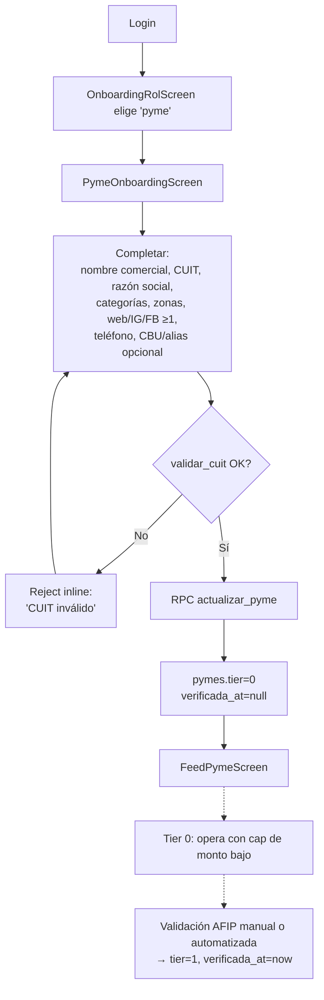

Validación de CUIT (DV) — ver `db/014_pymes_validacion.sql:31-64`:
- 11 dígitos, prefijo en {20, 23, 24, 25, 26, 27, 30, 33, 34}
- DV calculado con multiplicadores `[5,4,3,2,7,6,5,4,3,2]`

Verificación contra AFIP: **pendiente** — ver [spec-afip-cuit-validation.md](spec-afip-cuit-validation.md).

---

## 9. Casos límite (casuística cruzada)

### 9.1 Padres separados, ambos en el grupo, modalidad individual

- Cada uno se vincula como co-tutor del alumno via `alumno_join_as_tutor`.
- Ambos pueden anotarlo en una necesidad individual (idempotente: `necesidad_inscripciones` tiene `unique(necesidad, alumno)`).
- En la votación, votan por separado pero el peso se reparte entre tutores que voten ese alumno.
- En el pago, **el primero que marca, queda como `marcado_por`**. El otro lo ve como ya pagado.

### 9.2 Padres separados, ambos en el grupo, modalidad grupal

- Cada uno tiene su propia fila en `grupo_miembros` y vota como individuo.
- En el pago, cada uno tiene su propia fila en `necesidad_pagos`. Ojo: una "familia" con dos papás separados aparece como dos pagos. Hoy esto **no se desambigua** — es esperable que el grupo defina convención (ej. solo uno paga).

### 9.3 Tutor único que se va del grupo

`leave_grupo` no borra alumnos. Si el tutor era el único, `alumno_leave_as_tutor` debe ser invocado para desvincularse, lo que **borra al alumno** (porque queda huérfano).

> Edge case actual: `leave_grupo` no llama a `alumno_leave_as_tutor` automáticamente. Si un tutor abandona sin desvincularse de sus alumnos, los alumnos quedan en el grupo sin tutor activo en ese grupo (pero los `alumno_tutores` siguen apuntando al profile que se fue).

### 9.4 Pyme gana pero abandona la transacción

- No hay RPC para "renunciar a la adjudicación" hoy.
- El admin del grupo puede revertir vía... **no hay revertir adjudicación** (solo revertir cumplida). Workaround: cancelar la necesidad entera, republicar.
- TODO: RPC `revertir_adjudicacion` con ventana corta. Listado en backlog post-PMF.

### 9.5 Empate en votos / no hay votos

- La adjudicación es **manual**. El admin elige aunque haya empate o cero votos.
- El conteo de votos es informativo, no vinculante.

### 9.6 Necesidad sin ofertas

- Queda en `recibiendo_ofertas` indefinidamente. `fecha_limite_entrega` no la cierra automáticamente.
- TODO: cron que pase a `cancelada` al pasar la fecha. Hoy depende del admin.

### 9.7 Familia sale del grupo después de adjudicar pero antes de pagar

- `leave_grupo` no impide salir si tiene pagos pendientes.
- El registro `necesidad_pagos` no se cascadea: si vuelve, sigue siendo el `profile_id` referenciado.
- En modalidad individual el FK `alumno_id` está cascadeado. Si la familia se va y borra al alumno, su fila de pago se borra también. **Riesgo**: pyme pierde tracking. Mitigación futura: bloquear `leave_grupo` con pagos pendientes en estado < cumplida.

### 9.8 Una persona en varios grupos

- Soportado nativamente: `grupo_miembros` permite N filas por `profile_id`.
- En el FE hay un selector de grupo activo en el feed. El rol_en_grupo es independiente por grupo.

### 9.9 CUIT duplicado entre dos pymes

- Índice único parcial sobre `pymes.cuit` impide registrar el mismo CUIT en dos perfiles.
- La segunda pyme recibe error "CUIT ya registrado".

### 9.10 Pyme sin perfil completo intenta ofertar

- `crear_oferta` exige `exists(select 1 from pymes where profile_id = auth.uid())`. Falla con "Completá tu perfil pyme antes de ofertar".

### 9.11 Necesidad cancelada / revertida después de pagos

- Hoy no hay reglas explícitas: si se cancela una necesidad con pagos registrados, los pagos quedan huérfanos (FK on delete cascade los borra).
- TODO: requerir confirmación si cancelar implica borrar pagos.

---

## 10. Permisos / RLS — resumen

| Tabla / Acción | Quién puede |
|----------------|-------------|
| `profiles` SELECT/UPDATE | Solo el dueño |
| `grupos` SELECT | Miembros + view `grupos_por_invite` (anon, vía code) |
| `grupos` INSERT | Cualquier autenticado vía RPC `crear_grupo` |
| `grupo_miembros` INSERT | Self via `join_grupo_by_code` |
| `grupo_miembros` DELETE | Self (`leave_grupo`) o admin/creador (`kick_miembro`) |
| `alumnos` SELECT/INSERT | Miembros del grupo |
| `alumnos` DELETE | Implícito al perder el último tutor |
| `necesidades` INSERT | Miembros del grupo |
| `necesidades` SELECT | Miembros del grupo + view `necesidades_publicas` (pymes) |
| `ofertas` INSERT | Pyme con perfil completo |
| `ofertas` SELECT | Miembros del grupo + la pyme dueña de la oferta |
| `votos_oferta` INSERT | Miembros del grupo, sobre alumnos que tutorean |
| `necesidad_pagos` SELECT | Miembros del grupo + pyme ganadora |
| `necesidad_pagos` INSERT/DELETE | Vía RPCs `registrar_pago`/`eliminar_pago` |
| `pymes` SELECT | Self + view `pymes_publicas` (sin CBU/CUIT) |
| `pymes` UPDATE | Self vía RPC `actualizar_pyme` |

> Datos sensibles (CBU, CUIT, alias, email/tel del admin) se exponen **solo post-adjudicación** vía RPCs `contacto_pyme_ganadora` y `contacto_admin_grupo`.

---

## 11. Pantallas del frontend (referencia)

`github-pages/mapapis/index.html` — un solo archivo. Pantallas principales:

| Componente | Quién la ve | Función |
|------------|-------------|---------|
| `SplashScreen` | Todos (carga inicial) | Branding + spinner |
| `LoginScreen` | Anónimo | Auth + slogans rotativos + banner "Unirse" si `?join=CODE` |
| `OnboardingRolScreen` | Logueado sin rol | Elegir familia/pyme/institución |
| `PymeOnboardingScreen` | Pyme nueva | Formulario en 5 secciones (identidad, oferta, online, contacto, cobros) |
| `CrearGrupoScreen` | Familia sin grupo | Crear grupo (nombre, zona, tipo) |
| `UnirsePorCodigoScreen` | Familia con `?join=CODE` | Ver preview + join |
| `AlumnoStepScreen` | Familia recién unida | Match por nombre o crear alumno |
| `FeedFamiliaScreen` | Familia | Lista necesidades del grupo + tabs |
| `FeedPymeScreen` | Pyme | Necesidades públicas filtradas por zona/categorías |
| `DetalleScreen` | Todos según rol | Detalle + ofertas + voto + InscripcionPanel + CumplidaPanel + PagosPanel |
| `PublicarScreen` | Familia (admin/miembro) | Crear/editar necesidad |
| `GrupoScreen` | Familia | Settings: miembros, kick, promote, regenerar invite |
| `PerfilScreen` | Todos | Datos personales + cambiar rol + logout |

Theming por rol: `[data-role="familia|institucion|pyme"]` aplica color de fondo + accent (coral / violet / sage). Visible como `RoleBadge` flotante top-right.

---

## 12. Pendientes (no en este doc, pero referenciados)

- AFIP automatizado → [spec-afip-cuit-validation.md](spec-afip-cuit-validation.md)
- Mercado Pago split + escrow → [spec-pagos-escrow.md](spec-pagos-escrow.md)
- Calificaciones multi-dim de pymes → [spec-pymes-ratings.md](spec-pymes-ratings.md)
- UX institución profundizada → [spec-instituciones.md](spec-instituciones.md)
- Backlog corto: Mis ofertas (pyme), reviews básicos, panel founder, notificaciones email, tier badge, EditarPymeScreen, empty states, sanitización anti-leak en descripciones.

---

## 13. Cómo mantener este doc

- Cada migración nueva (`db/01N_*.sql`) que cambie tablas, estados o flujos críticos → actualizar la sección correspondiente.
- Los diagramas Mermaid se renderizan en GitHub directamente (preview en VS Code con extensión "Markdown Preview Mermaid Support").
- Si un caso límite real aparece y no está acá, agregarlo a §9 con el comportamiento actual + TODO si hace falta.
